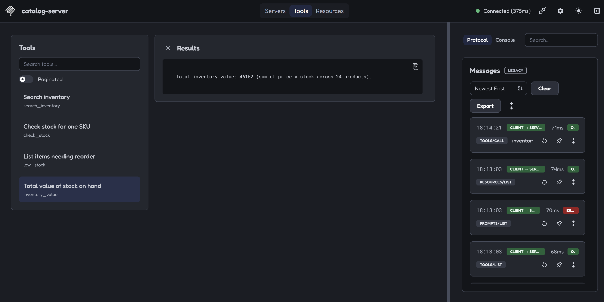
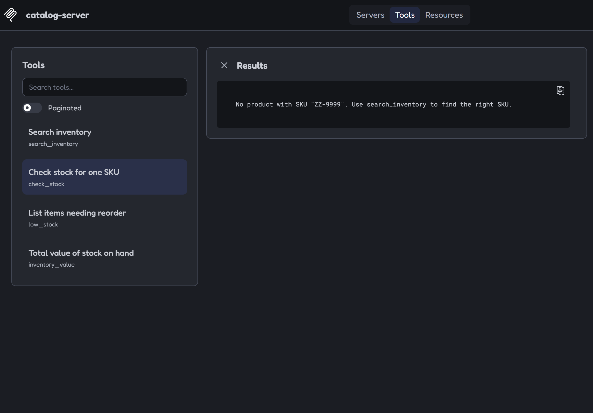

# Дебаг catalog-server через MCP Inspector

Мета — перевірити власний сервер інструментом, який говорить із ним по
протоколу, а не через чат. Чат показує, що агент **вирішив** зробити;
Inspector показує, що сервер **насправді віддає**.

**Інструмент:** `@modelcontextprotocol/inspector`, CLI-режим
**Сервер під тестом:** `mcp-server/dist/server.js` (stdio)
**Дата:** 2026-08-25

Використано обидва режими. CLI — щоб вивід можна було вставити в документ
дослівно:

```powershell
npx -y @modelcontextprotocol/inspector --cli node ./mcp-server/dist/server.js --method tools/list
```

Браузерний UI — щоб бачити панель Protocol із реальними JSON-RPC
повідомленнями:

```powershell
npx -y @modelcontextprotocol/inspector node ./mcp-server/dist/server.js
```

---

## Що побачили

### `tools/list` — три tools зі схемами й анотаціями

Скорочено до полів, які тут важливі (повний вивід містить ще описи):

```json
{
  "tools": [
    { "name": "search_inventory",
      "inputSchema": { "type": "object",
        "properties": { "query": { "type": "string" } },
        "required": ["query"] },
      "annotations": { "readOnlyHint": true, "destructiveHint": false,
                       "idempotentHint": true, "openWorldHint": false } },
    { "name": "check_stock",
      "inputSchema": { "properties": { "sku": { "type": "string" } },
        "required": ["sku"] },
      "annotations": { "readOnlyHint": true, ... } },
    { "name": "low_stock",
      "inputSchema": { "type": "object", "properties": {} },
      "annotations": { "readOnlyHint": true, ... } }
  ]
}
```

Перше підтвердження: `z.object({...})` у коді справді доїхав до дроту як
JSON Schema з `required`, а `annotations: READ_ONLY` — як окреме поле
протоколу. Тобто read-only тут **задекларовано хосту машинно**, а не обіцяно
в README.

### `resources/list` — один resource

```json
{ "resources": [ { "name": "catalog-summary", "uri": "inventory://catalog",
                   "mimeType": "application/json" } ] }
```

### Живі виклики

```powershell
--method tools/call --tool-name search_inventory --tool-arg "query=audio"
```

```
3 product(s) matched "audio":
HS-5001 — Headset Noise Cancelling (audio) · $199 · stock 19 · reorder at 10
HS-5002 — Headset Wired Basic (audio) · $49 · stock 5 · reorder at 12
SP-5003 — Desk Speakers Stereo (audio) · $79 · stock 23 · reorder at 10
```

```powershell
--method resources/read --uri inventory://catalog
```

```json
{ "productCount": 24,
  "categories": ["accessories","audio","cables","displays","furniture","peripherals","storage"],
  "inventoryValue": 46152,
  "lowStockCount": 9 }
```

`46152` і `9` збігаються з ground truth із [ab-validation.md](ab-validation.md).

---

## Що знайшли й полагодили

### 1. Половина реального питання не мала свого tool — **виправлено**

Головна знахідка, і вона видна саме в парі `tools/list` + `resources/list`,
покладених поруч:

| Питання з `materials/ab-question.md` | Де жила відповідь |
|---|---|
| «які SKU потребують дозамовлення» | tool `low_stock` |
| «загальна вартість запасів» | **тільки** resource `inventory://catalog` |

`inventoryValue: 46152` існував у сервері — але лише всередині resource. А
resource за специфікацією **application-controlled**: його читає хост, модель
його не викликає. Тобто на другу половину промпту в моделі не було жодного
доступного інструмента.

У прогоні A це не впало лише тому, що Claude Code дає окремий
`ReadMcpResourceTool`. У хості без такого механізму агент застряг би — і
`tools/list` виглядав би при цьому цілком повним.

**Виправлення** — четвертий tool, `inventory_value`:

```ts
server.registerTool("inventory_value", {
  title: "Total value of stock on hand",
  description:
    "Compute the total capital tied up in stock: sum of price × units on " +
    "hand across all 24 products, rounded to cents. Takes no arguments. Use " +
    "when the user asks what the inventory is worth, the total value of " +
    "stock held, or how much money is sitting on the shelves.",
  inputSchema: z.object({}),
  annotations: READ_ONLY,
}, async () => { /* delegates to inventoryValue() from app/ */ });
```

Resource лишився: він віддає знімок стану складу цілком, і це його роль.
Дублювання тут не помилка — це два різні способи доступу до одного числа,
і потрібні обидва.

Перевірка тим самим інструментом, яким знайшли дефект:

```powershell
--method tools/call --tool-name inventory_value
```

```
Total inventory value: 46152 (sum of price × stock across 24 products).
```

```powershell
--method tools/list   # після фіксу
```

```
"name": "search_inventory"   readOnlyHint: true
"name": "check_stock"        readOnlyHint: true
"name": "low_stock"          readOnlyHint: true
"name": "inventory_value"    readOnlyHint: true
```

Те саме в UI:



Праворуч видно те, чого CLI не показує, — **лог протоколу**. Видно і
`TOOLS/LIST`, і `RESOURCES/LIST`, і `TOOLS/CALL inventory_value`, кожен зі
своїм часом відповіді (68–74 ms). Тобто UI дає ще один рівень спостереження:
не лише що сервер відповів, а якими саме викликами й наскільки швидко.

Помітний і рядок `PROMPTS/LIST` із червоною позначкою — Inspector на старті
опитує всі capability підряд, включно з тими, яких сервер не оголошує. На
поведінку сервера це не впливає: перевірка тим самим методом через CLI
повертає `{ "prompts": [] }`, тобто коректну порожню відповідь.

### 2. Невідомий SKU — поведінка коректна, підтверджено

```powershell
--method tools/call --tool-name check_stock --tool-arg sku=ZZ-9999
```

```
No product with SKU "ZZ-9999". Use search_inventory to find the right SKU.
```



Не виняток, не порожній результат, а текст, який ще й скеровує модель до
потрібного tool. Це перевірялось саме тому, що такий шлях у чаті майже
ніколи не трапляється — агент підставляє валідні SKU.

### 3. Валідація схеми працює **до** хендлера

Виклик `search_inventory` без обов'язкового `query`:

```json
{ "content": [ { "type": "text",
    "text": "Input validation error: Invalid arguments for tool search_inventory: query: Invalid input: expected string, received undefined" } ],
  "isError": true }
```

Зупинив це не мій код, а SDK — за схемою, ще до входу в handler. Тобто
`inputSchema` не декоративний: сервер не покладається на те, що клієнт
надішле правильні аргументи. Разом із `isError: true` це коректний
протокольний рівень помилки, а не падіння процесу.

### 4. `console.error` не ламає протокол — видно на власні очі

У кожному прогоні перед JSON стоїть рядок `catalog-server ready on stdio
(read-only)`. Він іде в **stderr**, тому Inspector його показує, але не
намагається розібрати як JSON-RPC. Якби це був `console.log`, повідомлення
потрапило б у stdout і зламало б handshake. Правило «логи тільки в stderr»
тут перевірене, а не процитоване.

---

## Що дає Inspector порівняно з «просто спробувати в чаті»

Обидва дефекти вище чат **не показав би**:

- **Розділяє шар протоколу і шар моделі.** Коли в чаті tool не спрацював,
  причин дві: сервер віддав погано або модель вирішила не викликати.
  Inspector прибирає другу — усе, що він показує, прийшло з сервера.
- **Показує capability, а не поведінку.** Дефект з `inventory_value` — це
  саме дірка в capability. У чаті вона була замаскована тим, що хост має
  `ReadMcpResourceTool`; у `tools/list` вона видна одразу.
- **Дозволяє викликати те, чого модель не викличе.** Порожні й невалідні
  аргументи, неіснуючий SKU — агент такі входи майже не генерує, а реальний
  клієнт колись згенерує.
- **Не потребує перезапуску хоста.** Правку в сервері видно наступною
  командою, без циклу «перезібрати → перезапустити VS Code → новий чат».

Практичний висновок: **Inspector — це юніт-тест рівня протоколу.** Чат
відповідає на питання «чи агент упорався», Inspector — на питання «чи сервер
взагалі дає чим упоратись». Друге треба перевіряти першим, бо повний на
вигляд `tools/list` ще не означає, що реальне питання покрите.
